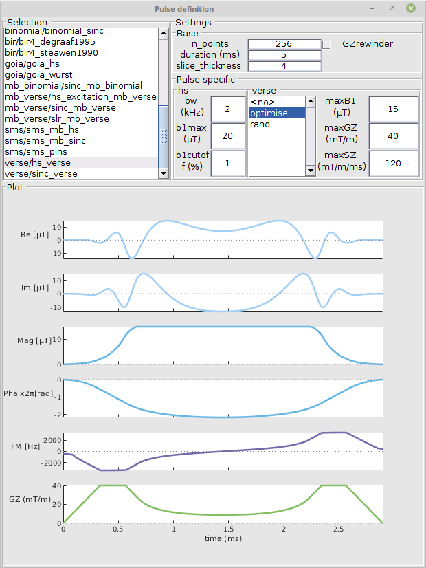
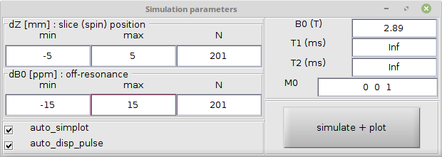
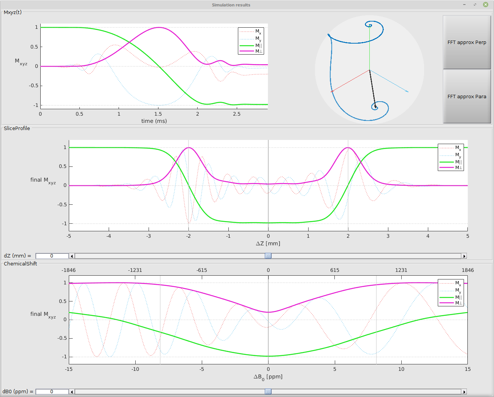

# MRI $RF$ pulse simulation in MALTAB

This repository is a MATLAB application that simulate the response of MRI **R**adio**F**requency (**RF**) pulses.
The app is a GUI, and the code also made to be used purely programmatically.

1. Open the GUI app
2. Click on a pulse in the library list.
3. The selected $RF$ pulse is loaded with default parameters, plotted in the GUI, and it's simulation triggered. The simulation is plotted automatically : magnetization vector across time $M_{xzy}(t)$, slice profile $\Delta Z$, chemical shift profile $\Delta B_0$.

The application is highly object oriented, to take advandtage of heritage and composition of several abstract classes.

Also, you can use your own pulses in the app by :
- A super fast method : fill the $RF$ pulse shape ($B1$ curve $GZ$ curve) in the the `USER_DEFINED` pulse. This is "empty" pulse, used as placeholder in the app. _Example usage : if  you have Brucker pulse file (.exc .rfc .inv), load it with [load_bruker_RFpulse](+mri_rf_pulse_sim/load_bruker_RFpulse.m), fill the `USER_DEFINED` pulse, then trigger the GUI so simulate the profile._
- An ergonomic method made for interativity : add your own $RF$ pulse class in `+mri_rf_pulse_sim/+rf_pulse/+local/` so it will appear in the GUI library. _This directory is not versioned in this repo_

## Features

### GUI
The GUI have 3 independent panels :
- **Pulse definition** : It shows the library of pulses, and the selected pulse, including its shape and the UI parameters.

- **Simulation parameters** : You define the range and granularity (number of points) for the slice profile evaluation $\Delta Z$ and the chemical shift $\Delta B_0$ evaluation.

- **Simulation results** : Displays $M_{xzy}(t)$, the slice profile $\Delta Z$, and the chemical shift $\Delta B_0$ profile.

### Scripting
Here is some examples of non-GUI analysis :  
- [Why SINC is used for slice selection instead of to RECT ?](+mri_rf_pulse_sim/+analysis/rect_vs_sinc.m)
- [Too much B1max ? RF clip ? maybe increase pulse duration](+mri_rf_pulse_sim/+analysis/rf_clip.m)
- [FOCI is derived from HS pulse. But is it better ?](+mri_rf_pulse_sim/+analysis/compare_hs_foci.m)
- [Why do we need a slice selection gradient **rewinder** ?](+mri_rf_pulse_sim/+analysis/slice_selection_rewinder_lob.m)

### Object oriented programming
All pulses are objects.  
Pulses can inherit from others : `FOCI` is derived from `HyperbolicSecant`.  
Pulses can be composed of several abstract classes.
For example, `slr_mb_verse` is a **SLR** base waveform, then the **M**ulti**B**and algorithm is applied to excite several slices, and finally the **VERSE** algorithm reduces it's duration and $B1_{max}$ using constrains.

### Re-usability
One of the objectives here is to centralize the equations/algorithms of $RF$ pulse so they can be almost copy-pasted in other programming environments, like a complete sequence simulator, or a sequence development environment from your manufacturer.  
One difficulty when looking in the literature is that different sources can have different vocabulary or different parameters. A typical example is the **H**yperbolic**S**ecant, which is the extremely well described, but with a large variety of implementation using different input parameters.

## Examples

### HS : Hyperbolic Secant

### FOCI : Frequency Offset Corrected Inversion

## Download and install
1. Clone the repository with 
    - `git clone --recurse-submodules https://github.com/benoitberanger/mri_rf_pulse_simulation_matlab.git`
2. In Matlab, `cd /path/to/mri_rf_pulse_simulation_matlab`
3. Start the app with `mri_rf_pulse_sim.app()`

## Limitations
- MATLAB R2023a+ ? maybe few release earlier, but I did not test them.

## External dependency

**None**, except for : 
- For SLR pulses : 
    - DSP System Toolbox
    - Signal Processing Toolbox

## Tested on
MATLAB R2023a+

## Alternatives
In all alternatives that I found, in Python, MATLAB, Julia, all of them have very nice features, but none has the same interactivty and ergonomy.

- Python : https://github.com/mikgroup/sigpy
- Matlab : https://github.com/leoliuf/MRiLab
- Julia : https://github.com/cncastillo/KomaMRI.jl

## TODO list
https://github.com/users/benoitberanger/projects/2

