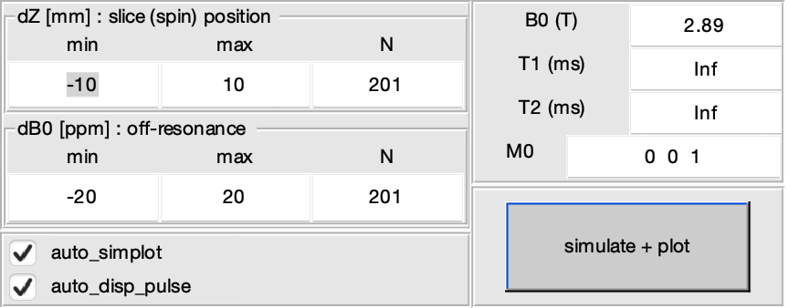

# Summary
**M**agnetic **R**esonance **I**maging (MRI) is a non-invasive non-ionisong technique mainly used to acquire images of the human body. To do so, MRI uses **R**adio**F**requency (RF) pulses to excite matter, and magnetic gradients to encode the image. This toolbox focuses on the simulation and evaluation of such RF pulses.

Why ? Because here is a **lot** of them ! Some pulses are designed to selectivly excite a specific volume, like a thin slice of matter, while other are called "non-selective" and will excite the whole volume, without spatial selectivity. Why are they so different from each other ? How to compare them ? Which one to choose ? The [main objective]{.ul} of this toolbox is to answer these questions, using a **G**raphical **U**ser **I**nterface (GUI) or pragramaticaly, or both.

# Statement of need
An RF pulse $B1(t)$ is _complex_ curve. It can be associated with a magnetic gradient curve $G(t)$ which is _real_. Modern MRI scanners do use this _complex_ RF curve : you provide the _magnitude_ $|B1(t)|$ and the _phase_ $\angle B1(t)$ of the pulse. To simulate the effect of the pulse, we can solve the Bloch equations [@Bloch:1946] that describe the evolution of a magnitisation vector $M_{xyz}(t)$ under a magnetic field $B1(t) + G(t)$. Depending on different starting conditions, we can evaluate, for example, the slice profile of a slice-selective RF pulse.

# Key features

## Interactivity
Open the GUI and click on a pulse in the library list. The pulse is loaded with default parameters, which are displayed and editable, and it's curves are plotted:  

{width="60%"}

In \autoref{fig:gui_pulse_definition}, you can see the selected pulse from the library, it's editable parameters, then the corresponding curves. Since the $B1(t)$ is _complex_, in the literature you can find the pulse described as _real(t)_ + _imaginary(t)_ or _magnitude(t)_ + _phase(t)_. Here, the 4 curves are drawn. Also, articles can present pulses with a "frequency modulation" (FM), as the derivative of the _phase(t)_. This FM curve is also shown. The last curve is the magnetic gradient : some pulses use constant magnetic gradient, other use a time-varying one.

Simulation parameters, such as magnetic field strength, can be edited :

{width="60%"}

All editable fields, checkboxs, etc in \autoref{fig:gui_simulation_parameters} can be manipulated programmatically.

By default, the simulation is automatically triggered, and the results plotted :

{width="100%"}

In \autoref{fig:gui_simulation_results} the pulse response is assessed using several subplots :  
- $M_{xyz}(t)$ is represented in a 1D-plot for each component, and with a 3D-plot to visualize the vector trajectory in space.  
- $SliceProfile(position)$ can be evaluated at different $frequency\_offcet$ using a slider.  
- $ChemicalShift(frequency\_offcet)$ can be evaluated at different $position$ using a slider.  

Changing a parameter such as the pulse duration, in the GUI or programaticaly, will update the pulse, re-plot it's curves, and the simulation updated.
All UI parameters possess an _update_ mechanism, mostly used to trigger the simulation with the fresh value. 

## Usage
As mentioned, the package was designed to work with both GUI and scripting. The GUI allows fast pulse exploration, since the simulation is updated if any parameter changes. Meanwhile, when you need to optimize pragramatically a pulse, or if you need to compare two pulses, coding should be a better choice. This is why there are many analysis scripts bundled.

The user can work with it's on pulses by:  
- Selecting the `USER_DEFINED` pulse in the GUI (see the top left of \autoref{fig:gui_pulse_definition}), then fill in the curves, and finally trigger the simulation.  
- Adding it's on pulses in a dedicated directory, so they will appear in th GUI's library list.  

## Modularity
Many pulses are composed using different algorithm. For example, `sinc_mb_verse` uses the Sinc as base waveform [@Bernstein:2004], then the Simultaneous Multi-slice MutliBand (mb) algorithm to excite multiple slices at once [@Barth:2016], and finally the VERSE algorithm compresses the pulse in time to achieve the same slice profile while keeping the pulse under constrains, such as the maximum RF amplitude [@Conolly:1988; @Hargreaves:2004]. The composition of `sinc_mb_verse` pulse comes from the heritage of all 3 classes : the `sinc` pulse, the `sms_mb` abstract class, and the `verse` abstract class : 
```matlab
classdef sinc_mb_verse < ...
        mri_rf_pulse_sim.backend.rf_pulse.verse  & ...
        mri_rf_pulse_sim.backend.rf_pulse.sms_mb & ...
        mri_rf_pulse_sim.rf_pulse.sinc
```
All pulses do have a reference to the book or the the article that described them. Many of them comes from [@Bernstein:2004]

# Limitations
The main limitation is MATLAB itself : it's licensing system is not as open as Python. However, in the MRI research community, which is quite academic, the license can be provided by the most of the academic research institutes.

# References
