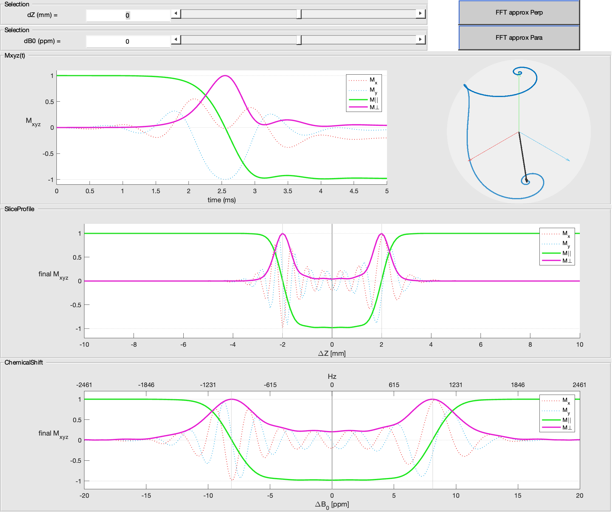

# Summary
**M**agnetic **R**esonance **I**maging (MRI) is a non-invasive non-ionisong technique mainly used to acquire images of the human body. To do so, $MRI$ uses **R**adio**F**requency (RF) pulses to excite matter, and magnetic gradients to encode the image. This toolbox focuses on the simulation and evaluation of such RF pulses.

Why ? Because here is a **lot** of them ! Some pulses are designed to selectivly excite a specific volume, like a thin slice of matter, while other are called "non-selective" and will excite the whole volume in the scanner.  
Why are they so different from each other ? How to compare them ? Which one to choose ? The [main objective]{.ul} of this toolbox is to answer these questions, using a GUI or pragramaticaly, or both.

# Statement of need
An RF pulse is _complex_ curve. It can be associated with a magnetic gradient curve which is _real_. Modern MRI scanners do use this complex RF curve : you provide the _magnitude_ and the _phase_ of the pulse. To simulate the pulse response, we can solve the Bloch equations [REF] that describe the evolution of a magnitisation vector under a magnetic field. Depending on different starting conditions, we can evaluate, for example, the slice profile of a slice-selective RF pulse.

# Key features

## Interactivity
Open the GUI and click on a pulse in the library list. The pulse is loaded with default parameters, which are displayed and editable, and it's curves are plotted:

Simulation parameters, such as magnetic field strength, can be edited :

By default, the simulation is automatically triggered, and the results plotted :


All UI parameters possess an _update_ mechanism, mostly used to trigger the simulation with the fresh value. Changing a parameter such as the pulse duration, in the GUI or programaticaly, will update the pulse, re-plot it's curves, and simulation updated.

## Usage
As mentioned, the package was designed to work with both GUI and scripting. The GUI allows fast pulse exploration, since the simulation is updated if any parameter change. Meanwhile, when you need to optimize pragramatically a pulse, or if you need to compare two pulses, code is a better choice. This is why there are many analysis scripts that serve as demos. These scripts use the full API provided by this package and take advantage of the MATLAB easy vector computation and plotting system.

## Modularity
Many pulses are composed using different algorithm. For example, `sinc_mb_verse` uses the Sinc as base waveform, then the Simultaneous Multi-slice MutliBand (mb) algorithm to excite multiple slices at once, and finally the VERSE algorithm compresses the pulse in time to achieve the same slice profile while keeping the pulse under constrains, such as the maximum RF amplitude. The composition of `sinc_mb_verse` pulse comes from the heritage of all 3 classes : the `sinc` pulse, the `sms_mb` abstract class, and the `verse` abstract class : 
```matlab
classdef sinc_mb_verse < mri_rf_pulse_sim.backend.rf_pulse.verse & mri_rf_pulse_sim.backend.rf_pulse.sms_mb & mri_rf_pulse_sim.rf_pulse.sinc
```

# Limitations
The main limitation is MATLAB itself : it's licensing system is not as open as Python. However, in the MRI research community, which is quite academic, the license can be provided by the most of the academic research institutes.

# References
